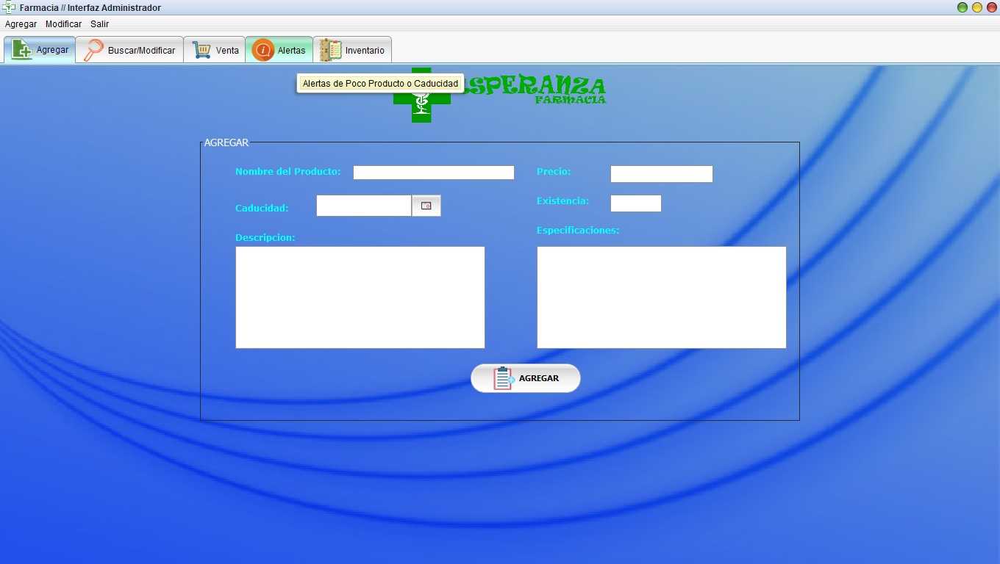

# EsperanzaPharmacy
_Aplicacion para la gestión de productos farmaceuticos_

## Obtener el Codigo 🚀
_Es necesario tener la IDE de NetBeans 12.3 y Xampp para MySQL, para luego hacer una clonacion o una descarga desde el repositorio._
_Más información visitar_
https://drive.google.com/folderview?id=1k2dAMmjrOXpNrNPmBYqCBL-DjaKSzZhp
### Pre-requisitos 📋
_El software nesecita java y Mysql para la instalación_

---
⌨️ realizado de ❤️ por [MarcoNina](https://github.com/Nina-99/) 😊
